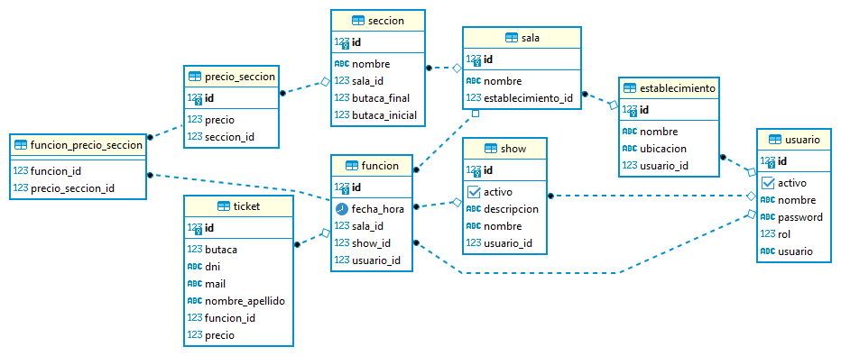

# ShowBusiness
Proyecto generado para dar respuesta a la técnica solicitada por personal de Meli.
[Documento de definición](./doc/ChallengeMeliShows.pdf ).

### Descarga del código
Previamente tener instalado git, luego ejecutar el comando:

~~~
git clone https://github.com/svidal1987/showBusiness.git
~~~
### Compilado del código
Previamente tener instalado maven y java, realizar los siguientes pasos:

~~~
cd showBusiness
mvn clean package
~~~
### Ejecución
~~~
cd target	
java -jar tecnica-0.0.1-SNAPSHOT.jar
~~~
# Descripción de la solución
En la implementación se proponen los siguientes endpints:  
-**Login**: Permite el inicio de sesión mediante JWT, con el cual se validará el usuario.  
-**Consulta de Shows**: permite obtener los Shows dado un rango de fecha y precio, u otros parámetros como el establecimiento, función o el mismo show puntual a ver  
-**Consulta de Función**: permite obtener las Funciones dado un rango de fecha y precio, u otros parámetros como el establecimiento, show o la misma función a visualizar.  
-**Consulta de disponibilidad**: permite consulta la disponibilidad de una función.  
-**Asignación de ticket**: permite a los portales asignar el ticket a un cliente particular.  

# Tecnologías utilizadas
-JAVA 11  
-Spring Boot  
-JPA  
-Cafeine  
-Spring doc (Swagger 3.0)

# Deploy en AWS
El deploy de la aplicación se realizó en AWS particularmente en Lightsail 1 GB RAM, 1 vCPU, 40 GB SSD Ubuntu Virginia, Zona A (us-east-1a). En este servidor se dejó el API(en segundo plano), por ello solo se instaló java.

~~~
java -jar tecnica.jar &
~~~

La base de datos implementada es un postgresql previamente instalado, este se encuentra en un EC2 (t2.micro)
En particular, también se configuró un subdominio de serlino.com.ar "showbusiness", desde Route53

Para realizar las pruebas sobre las API desarrolladas se deja link de postman tanto para pruebas locales como en servidor AWS

[https://www.getpostman.com/collections/ed77c8772d105d11aa3d](https://www.getpostman.com/collections/ed77c8772d105d11aa3d)
# Documentación
Para una mejor comunicación con los portales se dejó implementada la documentación de la API mediante Swagger 3.0:
[http://showbusiness.serlino.com.ar:8080/api/swagger-ui/index.html](http://showbusiness.serlino.com.ar:8080/api/swagger-ui/index.html)  

También el json para generar el cliente:  
[http://showbusiness.serlino.com.ar:8080/api/v3/api-docs](http://showbusiness.serlino.com.ar:8080/api/v3/api-docs)
# Cache
La implementación del cache se realizó de la mano de spring boot + cafeine, este cache se dejó habilitado durante 15seg. 

~~~
	@Bean
	public Caffeine caffeineConfig() {
	    return Caffeine.newBuilder().expireAfterWrite(15, TimeUnit.SECONDS);
	}
~~~

# Otros comentarios
En el código no se implementaron mappers para la salida de las API, se utilizaron directamente las clases del modelo por lo cual, solo se ocultaron  algunas variables mediante @JsonIgnore.
 

# DER 

